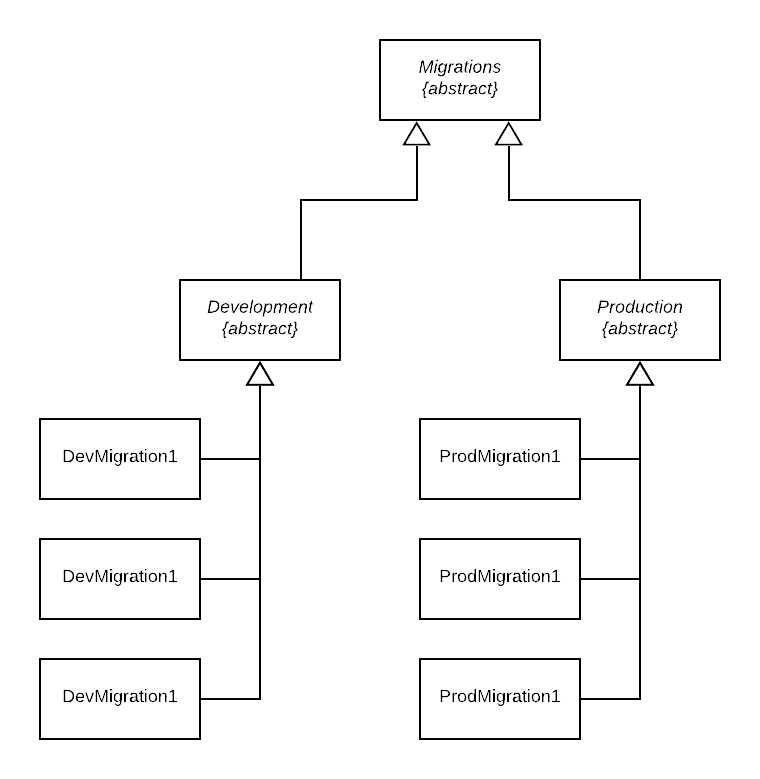

# Distancify.Migrations

A simple agnostic toolkit for managing controlled migrations in any .NET system, either at runtime or startup. Migrations can be database schema changes, but can also be API-calls to external Saas services. You are free to do whatever you want. This library makes sure the correct migration only runs once.

The library support custom data storage providers for controlling which migrations has been applied in the past.

Supports branches of migrations to be written and applied for different environments.

_Note_ that this library does not support downgrading. In order to revert a previous migration, simply create a new one that reverts the previous changes.

## Getting Started

### Install

```
Install-Package Distancify.Migrations
```

### Using

Create a migration by inheriting the Migration class:

```csharp
public class MyMigration : Migration
{
    public override void Apply()
    {
        // Migration code goes here
    }
}
```

Create an instance of MigrationService:

```csharp
var migrations = new MigrationService(new DefaultMigrationLocator(), new InMemoryMigrationLog());
```

Apply all migrations:

```csharp
migrations.Apply<Migration>();
```

## Develop migrations

### Migrations Tree

Using the `DefaultMigrationLocator` You can create a tree of migrations consisting of different branches. This is useful if you use migrations to set up configuration/data at runtime, for example when there are configurations stored outside of your code, such as a database. It's also an effective way of setting up data for acceptance testing if your doing manual or automated UI testing.

In order to create a branch, simply create an abstract migration:

```csharp
public abstract class MyMigrationBranch : Migration
{
}
```

Then use this as a base class for your migrations:

```csharp
public class MyMigration : MyMigrationBranch
{
    public override void Apply()
    {
        // Migration code for migration that only runs when MyMigrationBranch is applied
    }
}
```

Then apply the migration branch:

```csharp
migrations.Apply<MyMigrationBranch>();
```

You may also have nested branches since `DefaultMigrationLocator` will apply any depending migrations.



### Disable commit log during development

During development, it's common to work on the same migrations over multiple iterations/development cycles. In order to not have to go back and clear the migration log to force a migration to be applied again, the `DoNotCommit` attribute can be applied to the migration.

```csharp
[DoNotCommit]
public class MyMigration: Migration
{
	...
}
```

## Logging

The project uses Serilog internally so if you want to capture log output, make sure to hook up Serilog to a sink.

## Running the tests

The tests are built using xUnit and does not require any setup in order to run inside Visual Studio's standard test runner.

## Contributing

Please read [CONTRIBUTING.md](CONTRIBUTING.md) for details on our code of conduct, and the process for submitting pull requests to us.

## Versioning

We use [SemVer](http://semver.org/) for versioning.

## Publishing

Use CreateRelease.ps1 to create a new release. There's a CI build from every __master__ build on Distancify's internal NuGet feed.

## Authors

See the list of [contributors](https://github.com/distancify/Distancify.Migrations/graphs/contributors) who participated in this project.

## License

This project is licensed under the LGPL v3 License - see the [LICENSE](LICENSE) file for details